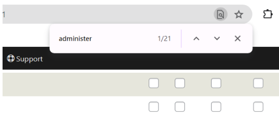
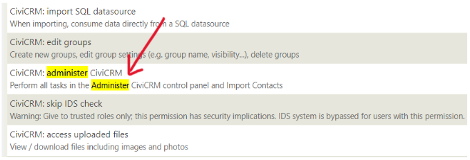
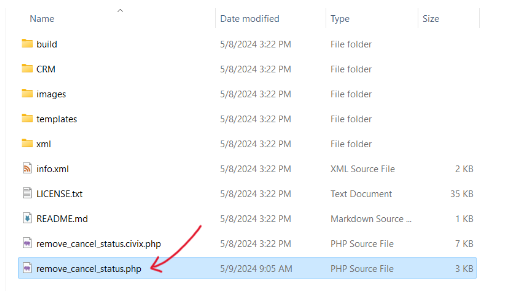
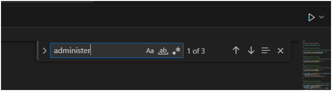
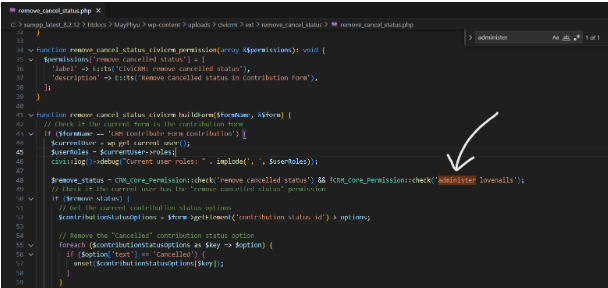
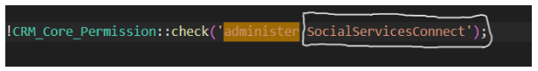
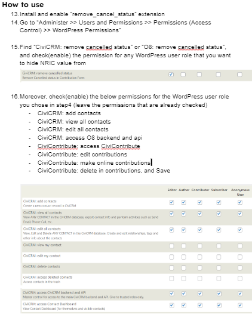
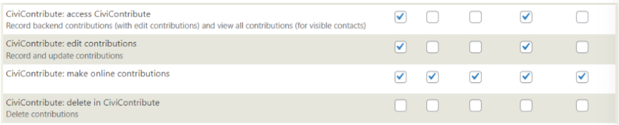

# Remove "Cancelled" status

## Objective
To remove “Cancelled” status in all contributions from the specific WordPress User Roles who we desire to hide 

1. “Administer >> Users and Permissions >> Permissions (Access Control) >> WordPress Permissions”

2. Press “Ctrl” and “F” on the keyboard simultaneously and search the word “administer”

3. Observe the word after “administer” whether it is “administer O8” or “administer CiviCRM” or “administer SocialServicesConnect” or “administer ……”

4. Take note of the word after “administer” and Extract the zip file of the extension.

5. Open the extracted files and open “remove_cancel_status.php” in Visual Studio

6. Press “Ctrl” and “F” on the keyboard simultaneously and 
Type “administer” in search field

7. “administer” will be highlighted in 1 place

8. Change the word after “administer” according to the word you noted in step4 (for me, it is ‘CiviCRM)

9. Save “remove_cancel_status.php” 

This is an [extension for CiviCRM](https://docs.civicrm.org/sysadmin/en/latest/customize/extensions/), licensed under [AGPL-3.0](LICENSE.txt).

## Getting Started

